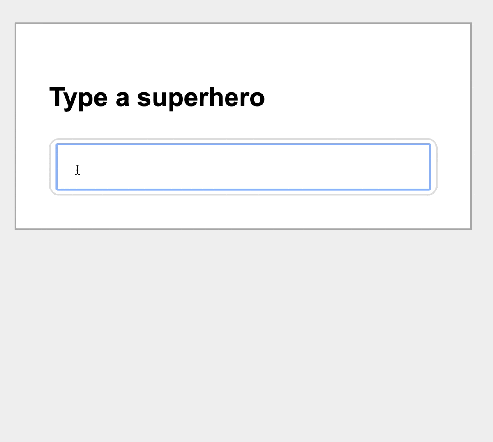

# stimulus-multi-select

This is a work-in-progress library that uses [Stimulus](https://stimulus.hotwire.dev) to turn a `<select>` element into a type-ahead multiple selection component.
I created this to replace some older libraries that I was using that had jQuery and/or bootstrap dependencies.

This library is intended to work well with [Tailwind CSS](https://tailwindcss.com), but ultimately you are in control of the styling.

Dependencies:

- `stimulus 2.0`

## Features

- Type to filter items
- Keyboard support (up/down, enter to select, escape to close)
- Click to remove selected items
- Backed by a hidden HTML `select` tag
- (optionally) create new items



## How to use

Add the package to your `package.json`:

```bash
yarn add stimulus-multi-select
```

Register the controller:

```javascript
// wherever you are setting up your Stimulus controllers, i.e. application.js
import { Application } from "stimulus"
import { definitionsFromContext } from "stimulus/webpack-helpers"
import MultiSelectController from "stimulus-multi-select"

const application = Application.start()

// you probably have something like this where you register controllers automatically
const context = require.context('../controllers', true, /\.js$/)
application.load(definitionsFromContext(context))

// add this to register it manually
application.register("multi-select", MultiSelectController)
```

You can also create your own file in `controllers` and register it automatically, for instance if youw ant to subclass and override some behavior.

Attach the controller to an element. It requires some structure to be present:

```html
  <div
      data-controller="multi-select"
      data-multi-select-result-class="multi-select-result"
      data-multi-select-result-selected-class="multi-select-result--selected"
      data-multi-select-item-active-class="item--active"
      class="relative">
      <div data-multi-select-target="field" class="field">
        <div data-multi-select-target="activeItems">
          <template>
            <span class="item--active">
              <span>ITEM TEXT WILL GO HERE</span>
              <button>
                <svg class="w-3 h-3 text-white" fill="none" stroke="currentColor" viewBox="0 0 24 24" xmlns="http://www.w3.org/2000/svg"><path stroke-linecap="round" stroke-linejoin="round" stroke-width="2" d="M6 18L18 6M6 6l12 12"></path></svg>
              </span>
            </span>
          </template>
        </div>
        <input data-multi-select-target="input" type="text">
      </div>
      <select multiple data-multi-select-target="select">
        <option></option>
        <option selected value="superman">Superman</option>
        <option value="spider">Spider-Man</option>
        <option value="batman">Batman</option>
        <option selected value="iron-man">Iron Man</option>
        <option value="wonder-woman">Wonder Woman</option>
        <option value="the flash">The Flash</option>
        <option value="storm">Storm</option>
      </select>
      <ul class="hidden multi-select-results" data-multi-select-target="results">
      </ul>
    </div>
```

Some important things to note:

- the `<template>` is not required but recommended to represent the selected items. Otherwise the library will generate a simple `<span>` for you but will be more difficult to style.
- The `<select>` tag is where you'll add your source data and any initial selections. A blank row is _required_. All other rows are expected to have a `value` or they will be ignored when filtering.
- This library relies on toggling a `hidden` CSS class to control visibility. If you're already using Tailwind CSS this will just work. If not you'll need to define this somewhere:

```css
.hidden { display: none; }
```

## Things not done

This controller is probably lacking in accessibility. PRs welcome.

## To edit locally and make changes

This utilizes `webpack-dev-server` to bundle and live-reload an example playground. To run it:

```bash
npm run playground
```

## Options

- `data-multi-select-result-class` - a list of classes that will be applied to the `<li>` results
- `data-multi-select-result-selected-class` - a list of classes that will be applied to `<li>` results that are selected via keyboard. Recommended to add similar hover styles to the above class to match.
- `data-multi-select-item-active-class` - This is only used if you are _not_ using the `<template>` to define the selected item look. This class will be applied to the generated `<span>` tag.
- `data-multi-select-allow-duplicates-value` - (default `"false"`) - Set this to true to allow the same option to be selected multiple times.
- `data-multi-select-allow-creating-new-entries-value` - (default `"false"`) - Set this to true to allow creating arbitrary entries.

## Feedback?

I'm admittedly not well versed in creating javascript packages. If you have ideas for improvement, feel free to open a PR.

## License

This library is released under the MIT license.
